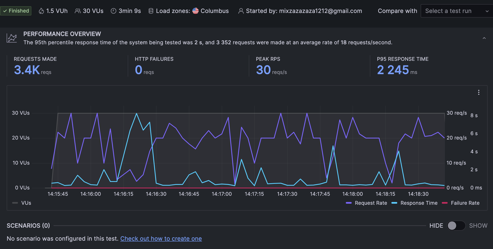
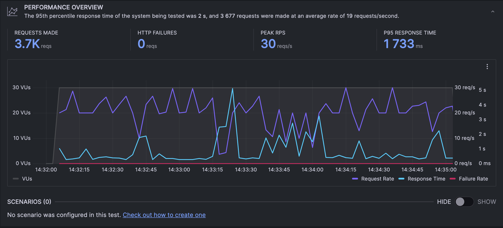

# TestBench Fiber Vs Echo
Using my own labtop to test the result might not be 100% accuracy

This test use 30 virtual user that always send a request into a server for 3 minutes

## Spec
- Apple M1
- 8 GB Memory
- 512 MB Disk

## Tools
- K6
- Grafana
- Golang


## Echo Test Result


## Fiber Test Result


## Result
| Topic             | Echo    | Fiber   | Winner |
|-------------------|---------|---------|--------|
| Request Make      | 3352    | 3677    | Fiber  |
| P95 RESPONSE TIME | 2 245ms | 1 733ms | Fiber  |

## Step Of Testing
### 1.Install k6
```
brew install k6
```

### 2.Create Golang server for echo and fiber
- Source code can be found in repo

### 3.Write script test
In this test I use 30 virtual user send request for 3 minutes long
```
export const options = {
    vus: 30,
  duration: '3m',
  ext: {
    loadimpact: {
      projectID: XXXXX,
      name: 'Test Fiber (20/01/2024)'
    }
  }
};
```

### 4. Login to Grafana
```
k6 login cloud --token  xxxxxxxxxxxxx
```

### 5. Start a Golang server and run a script
In both echo and fiber use the same command to start a server
```
go run main.go
```

Running script
```
k6 cloud script/fiber.js
k6 cloud script/echo.js
```
